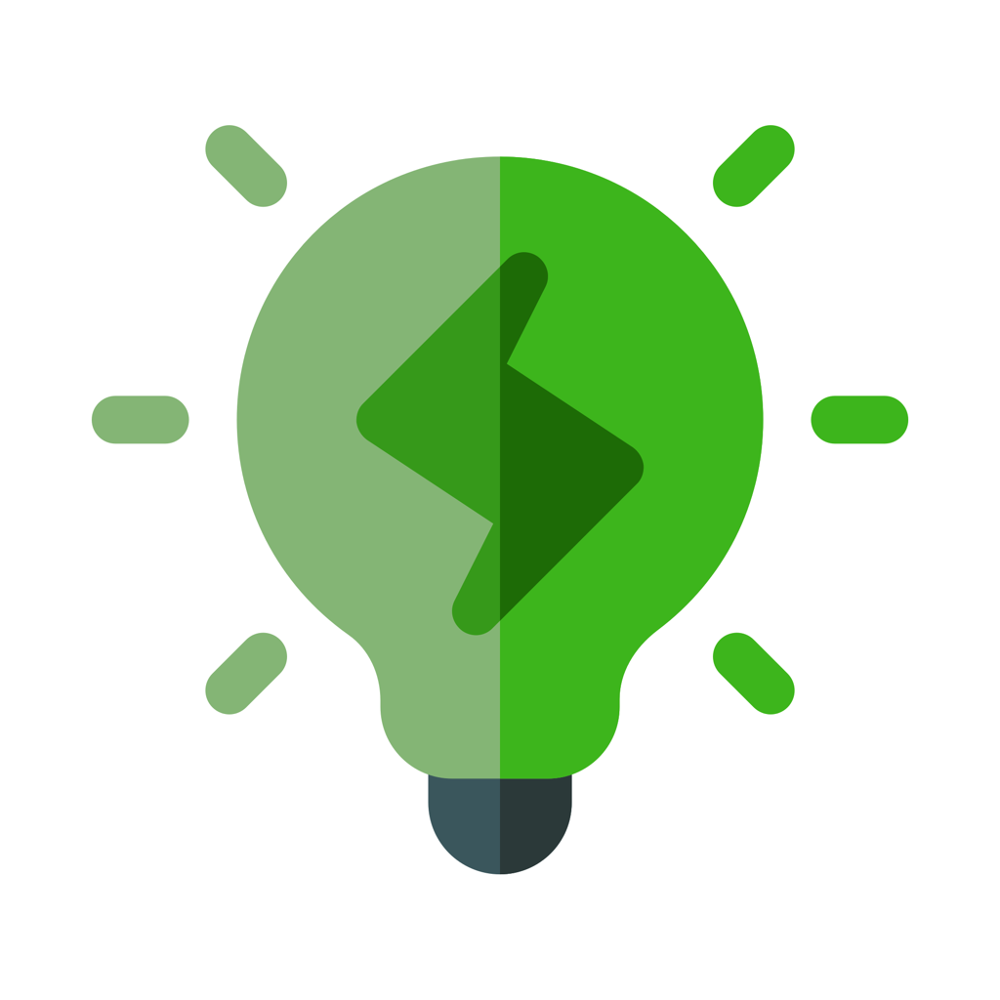

<h1>
 Eprimora 
</h1>

Este aplicativo foi desenvolvido para um trabalho acadêmico, o qual utiliza a TI Verde como suporte a economia financeira. Desse modo, desenvolvemos uma interface interativa e inovadora, para facilitar a entrada de dados fornecida pelo usuário, aprimorando assim, seu consumo de energia.

## Screenshot

